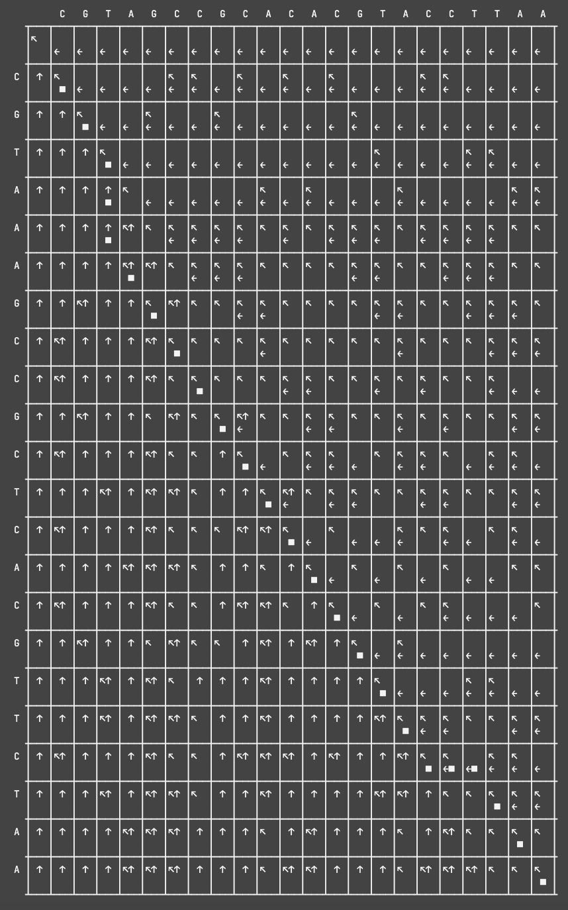

# Needleman-Wunsch


The Needleman-Wunsch algorithm, first described in [this paper](https://www.sciencedirect.com/science/article/pii/0022283670900574?via%3Dihub), is a dynamic-programming algorithm for global sequence alignment
## Scoring Scheme
The higher the score between two sequences, the better they are aligned. The score calculation has two main attributes the **Similarity Matrix** and the **Gap Penalty**
### Similarity Matrix
The algorithm should prioritize matching nucleotides or amino acids, so those are given a positive score. In my implementation I use a dictionary, with a set as the key, and score as the value:
```
similarity_matrix={
    {G, G} : 1
    {G, C} : -1
    {G, A} : -1
    ...
}
```
For protein sequences PAM and BLOSUM scoring matrices are usually used, but for this proof of concept, matching nucleotides get a +1 score, and non-matching nucleotides get a -1 score
### Affine Gap Penalty
It is more biologically likely that a few larger indels occur instead of many smaller ones, and this is reflected in the algorthim using an affine gap penalty. While starting a gap is -1 (the same as a mis-match), the penalty for opening a gap is much larger (-5 in this case).

For example, when matching the following sequences:
`CAAAATAAAATAAATGCC` and `CATATATGCC` although this alignment matches all nucleotides perfectly:
```
CAAAATAAAATAAATGCC
|   |||   ||  ||||
C---ATA---TA--TGCC
```
The following alignment is produced, since it opens less gaps:
```
CAAAATAAAATAAATGCC
|        |||*|||||
C--------ATATATGCC
```
## Dynamic Programming Matrices
## Sample Program Run

```
CGT--AGCCGCACACGTACCTTAA
|||  ||||||*|||||*|  |||
CGTAAAGCCGCTCACGTTC--TAA
```
Score: 2



Needleman, S B, and C D Wunsch. “A general method applicable to the search for similarities in the amino acid sequence of two proteins.” Journal of molecular biology vol. 48,3 (1970): 443-53. doi:10.1016/0022-2836(70)90057-4